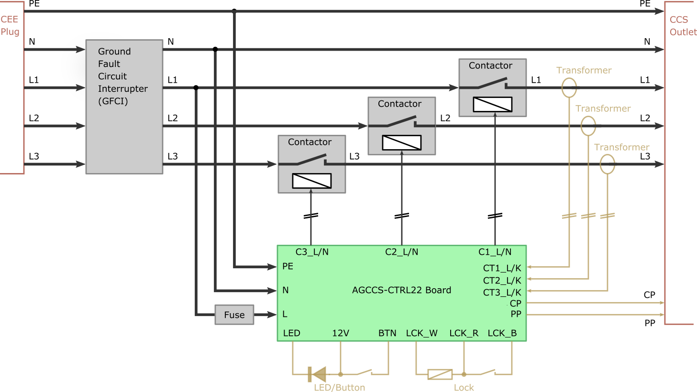
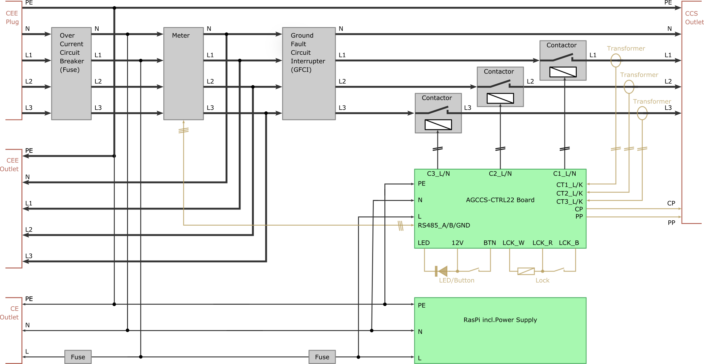

# Installation

Each AGCCS-CTRL22 unit shall be safely installed in an appropriate enclosing. Do not consider installation unless you possess adequate skills. The following external components are recommended.

- a CEE plug for power supply with three phases L1, L2 and L3; although operation is possible with one phase only, this will increase charging time considerably and is not considered a viable option in this document; the unit can be configured to run up to 3x32A, however, restrictions apply and you may need to notify/ask your electricity provider; for permanent installation, you may obit the CEE plug and directly wire the unit to the mains supply;

- a three phase ground fault circuit interrupter (GFCI) of adequat rating; local regulations may insist in a Type B device to detect DV faults, which are considerably more expensive than the common Type A modules;

- a house installation over current circuit interrupter (aka fuse) to power the AGCCS board; although the board has an internal fuse, it is very convenient to be able to manually power cycle the system;

- three adequately rated contactors to forward individual phases to the EV; if you do not plan to operate on single individual phases, you may opt for a single three-phase contactor to reduce cost; this however requires adjustments of the firmware; the firmware is designed to only operate the contactors  when idle i.e. with no current; thus, you should get away with affordable house installation contactors; 

- a CCS power outlet optionally with mechanical lock; regarding the lock, our circuitry is designed for operation at 12V and will deliver up to 4 Amps for some milliseconds; as with the CEE plug, you may opt for a fixed charging cable instead, and circumvent the trouble with the lock; however, we believe that an outlet is more convenient in many application scenarios;

- three current sensing transformers; the AGCCS circuit is parametrised to best operate with 100A:50mA transformers and we have specifically tested our circuitry with "YHDC SCT013" type transformers; using transformers with different parameters requires a careful review of the circuitry;

- an operator button, preferably with a built-in LED incl. an appropriate resistor for 12V operation;

- for the wiring the maximal target current needs to be observed; commissioning for max  3x16A is much easier than for max 3x32A and both the contactors and the GFCI come at a lower price when rated for less current. 

  

For our basic test rigs, the wiring is according to the below diagram. Configured for 3x32A, relevant wires are 6 square-mm. A photo of one such unit is given on the main page of this repository.

 We are currently in the process of assembling a slightly larger unit that additionally holds a power-meter with RS485 interface and a Raspberry Pi, and that forwards the CEE supply to a CEE/CE outlet. The placement of the meter in this proposal is a compromise between (a) running in stand-alone mode an calibrating the internal current reading and (b) attaching additional units via the CEE outlet and monitoring the overall load. 

