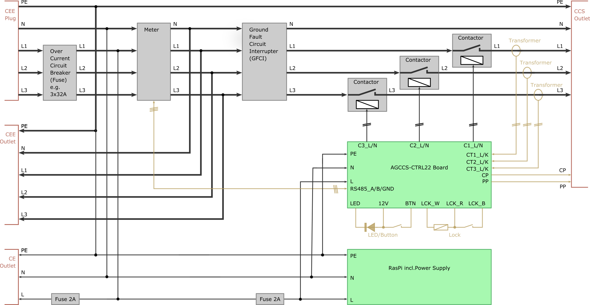

# Installation

Each AGCCS-CTRL22 unit shall be safely installed in an appropriate enclosing. Do not consider installation unless you possess adequate skills --- **if you are uncertain whether you possess such skills then you do not possess those skills**. 

The following external components are recommended:

- a CEE plug for power supply with three phases L1, L2 and L3; although operation is possible with one phase only, this will increase charging time considerably and is not thought as a viable option in this document; the unit can be configured to run up to 3x32A, however, restrictions apply and you may need to notify/ask your electricity provider; for permanent installation, you may omit the CEE plug and directly wire the unit to mains;

- a three phase Ground Fault Circuit Interrupter (GFCI) of adequate rating; local regulations may insist in a Type B device to detect DC leakage, which are considerably more expensive than the more common Type A modules;

- an over current circuit interrupter (aka fuse) to power the AGCCS board; although the board has an internal fuse, it is very convenient to be able to manually power cycle the system;

- three adequately rated contactors to forward individual phases to the EV; the firmware is designed to only operate the contactors when idle i.e. with no load; thus, you should get away with affordable house installation contactors; for 32A, you may consider to parallel two contacts; if you do not plan to operate on single individual phases, you may opt for a single three-phase contactor to reduce cost (this requires adjustments in the firmware)

- a CCS power outlet, optionally with a mechanical lock; regarding the lock, our circuitry is designed for operation at 12V and will deliver up to 4 Amps for some tens of milliseconds; as with the CEE plug, you may opt for a fixed charging cable instead, and circumvent the trouble with the lock; however, we believe that an outlet is more convenient in many application scenarios;

- three current sensing transformers; the AGCCS circuit is parametrised to best operate with 100A:50mA transformers and we have specifically tested our circuitry with "YHDC SCT013" type transformers; using transformers with different parameters requires a careful review of the circuitry;

- an operator button, preferably with a built-in LED incl. an appropriate resistor for 12V operation;

- for the wiring the maximal target current needs to be observed; commissioning for max 3x16A is much easier than for max 3x32A and both the contactors and the GFCI come at a lower price when rated for less current. 

  

For our basic test rigs, the wiring is according to the below diagram. Configured for 3x32A, relevant wires are 6 square-mm. A photo of one such unit is given on the main page of this repository. [[below diagram as printable PDF]](./images/installation.pdf)

We are currently in the process of assembling a slightly larger unit that additionally holds a power meter with RS485 interface and a Raspberry Pi, and that forwards the CEE supply to a CEE/CE outlet. The placement of the meter in this proposal is a compromise between (a) running in stand-alone mode and calibrating the internal current reading and (b) attaching additional units via the CEE outlet and monitoring the overall load.  [[below diagram as printable PDF]](./images/installationx.pdf)

Specific parts used out test rigs. 

- 2A circuit breaker, 1TE, ABB 2CDS251001R0024, apprx 5Euro
- 2x20A contactor, 1TE, ABB ESB20-20-230, apprx 18Euro
- 2x25A contactor, 1TE, Finder 22.32.0.230.4320, apprx 16Euro
- 3x25A contactor, 2TE, Kopp IS-300.230.25, apprx 25Euro
- power meter, 3-phases, 63A, RS485, Schneider A9MEM3155, apprx 225Euro
- 3x40A ground fault circuit interrupter, Type B, ABB F204B-4003, apprx 400Euro
- 3x40A ground fault circuit interrupter, Type B, ETEK EKL1-63B, apprx 150Euro
- 32A CCS2 outlet, DUOSIDA, incl. lock, apprx 115Euro

The given prices have been sampled in July 2020 are meant for first orientation and all refer to European suppliers. 