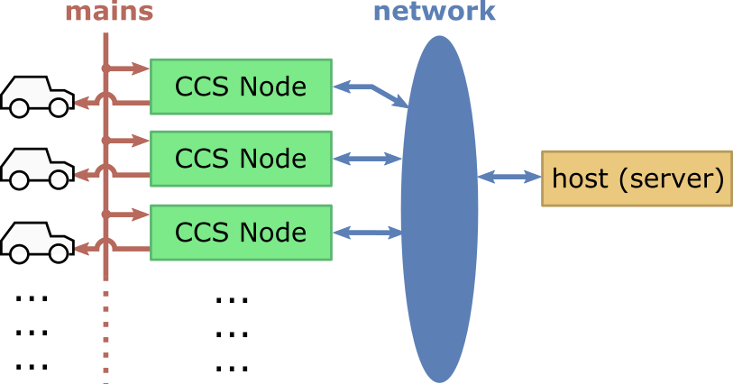

AGCCS-CTRL22
============

The Combined Charging System [CCS] provides the today's standard for low-cost home-charging of electric vehicles with up to 22kW. The specification includes a simplistic protocol by which the vehicle and the charging station negotiate available power. Of-the-shelf wallboxes forward the common 3x230V supply at an adjustable current limit to the vehicle via the CCS standard.

The aim of this project is to scale the simplicity of the low-cost single-user wallbox to larger parking lots in order to address appartment buildings or shopping venues. These configurations are characterised by a limited and possibly varying amount of available power. Hence, a fixed allocation per parking slot would be inefficient. Instead, we seek for an environment by which individual charging spots communicate and negotiate the power distribution dynamically. Conveivable schemes include first-come-first-serve, fairness-based energy distribution, or ready-to-go-by-schedule. 

Our implementation consists of three main components

- a hardware platform to implement a relevant subset of the CCS standard
- a per node software environment to control the charging process and to establish a communication network
- a centralized host for dynamic power allocation and monitoring 

All three components are open source and can be hence adapted to best fit a variety of application scenarios.

**DISCLAIMER 1** We do not provide a turn-key solution and do not plan to do so in near future. Rather we invite the enthusiast to actively contribute or to passively make use of the collection of resources and to share their experience.

**DISCLAIMER 2** All material provided in this repository comes 'as is' with no explicit or implied waranty. In particular, the development of equipment that runs on mains power should only be considered
be individuals with relevant skills and with particular care.

# Hardware Platform

Our hardware platform consists of 

+ relevant analog circuitry to implement the specified electric characteristics
+ an AVR series uC to control the charging process, and
+ an ESP32 SoC to provide means of wireless communication. 

Regarding the analog circuitry, our implementation is derived from the SmatEVSE project. Regarding the uC we opted for AVR allow for conveniently programming within the Arduino IDE --- although, at this stage the firmware we provide comes 'bare bone' for performance reasons. Regarding the SoC, we are fascinated by the powerful ESP32 SDKs available from Espressif. For our hardware platform, we provode schematics and a PCB Layout, both in editable KiCad format; see ./circuit

# Per Node Software

Each charging spot comes with an AVR uC for time/safety critical low-level behaviour which communicates via RS232 with an ESP32 for inter-node networking. While the AVR is programed from scratch, the ESP32 firmware builds on the MDF-SDK for wireless mesh-networking. From the latter, we expect a comperatively large area of coverage without additional inrastructure such as Wifi repeaters. Our mesh network subscribes to and publishes from an MQTT broker and is this interoperable with a wide range of possible server software. Both, the AVR firmware and the ESP firmware support OTA updates, i.e., no manual crawling along the parking lot. See also [./ctrl22](./ctrl22/) for the AVR firmware and [./demesh](./demesh/) for the ESP32 firmware.

# Server Software

At the time of writing, we only provide an elementary monitoring server implemented in Python
for development/testing purposes; see [./utils](./utils/). This will be substantially updated in the
very near future --- stay tuned.

# How/Where/Why to Get Started

Well, no turn-key solution ... but perhaps some interesting venues for the enthusiast.

- If you are interseted in hardware and want to assemble your very own CCS implementation there are only a view likewise open projects, e.g.,  https://www.smartevse.nl/,  https://www.openevse.com/. You are invited to inspect our proposal [./circuit](./circuit/), compare the specifications and take your choice.

- If you are interested in ESP32 mesh networking, perhaps for a completely different target application, feel free to run our implementation [./demesh](./demesh/) in stand-alone mode on common ESP32 dev-boards or more conveniently on M5Sticks. Features include OTA firmware update, control via MQTT and/or plain TCP sockets, synchronized system time, Optiboot (STK500) programming of a target AVR uC.

  

