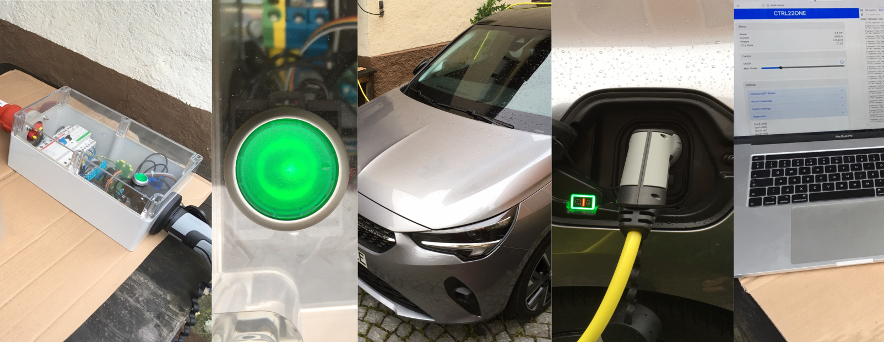

AGCCS-CTRL22
============

We propose a design for a network of EV charging stations compliant to the CCS standard. The repository is organised as follows:

- [./circuit](./circuit/): hardware platform, incl. schematics and a HowTo on firmware installation
- [./ctrl22c](./ctrl22c/): AVR firmware to control the charging process
- [./demesh](./demesh/): ESP32 firmware to organise messaging over a wireless mesh network
- [./monitor](./monitor/): server software for overall control and monitoring of the charging station network
- [./utils](./utils/): scripts to facilitate first-installation and debugging
- [./arduino](./arduino/): Arduino IDE compatible firmware for stand-alone operation (side track)
- [./doc](./doc/): Thesis and other documents regarding this project

**DISCLAIMER 1.** We do not provide a turn-key solution and do not plan to do so in near future. Rather we invite the enthusiast to actively contribute or to passively make use of our collection of resources and to share their experience. The current project status is **"work in progress"**.

**DISCLAIMER 2.** All material provided in this repository comes *'as is'* with no explicit or implied warranty. In particular, the installation of equipment that directly connects to mains power should only by considered by individuals with adequate skills and with particular care.

## Motivation

The Combined Charging System (CCS) provides a specification for low-cost home-charging of electric vehicles (EVs) with up to 22kW. It is based on a simplistic protocol by which the vehicle and the charging station negotiate available power. Of-the-shelf wall-boxes forward the common 3x230V supply at an adjustable current limit to the vehicle via the CCS standard.

The aim of this project is to scale the simplicity of the low-cost single-user wallbox approach to larger parking lots in order to address appartment buildings or shopping venues. These configurations are characterised by a limited and possibly varying amount of available power. Hence, a fixed allocation per parking slot would be inefficient. Instead, we seek for an environment by which individual charging spots communicate and negotiate the power distribution dynamically. Conveivable schemes include first-comes-first-serve, fairness-based-energy-distribution, or ready-to-go-by-schedule. Optionally, an external agent may limit the ussage of non-renewable enery in favour of e.g. available solar power at the given time to the day. 

Our implementation consists of three main components

- a **hardware platform** to implement a relevant subset of the CCS standard
-  **node firmware** to control the charging process and to establish a communication network
- a centralised host for dynamic power allocation and **monitoring** 

All three components are open source and can be hence adapted to best fit a variety of application scenarios.

## Hardware Platform

[Our hardware platform](./circuit/) consists of 

+ relevant analog circuitry to implement the specified electronic characteristics
+ an AVR series uC to control the charging process, and
+ an ESP32 SoC to provide means of wireless communication. 

Regarding the analog circuitry, our implementation is derived from the [SmatEVSE project](https://github.com/SmartEVSE). Regarding the uC, we opted for an AVR ATmega to allow for conveniently programming within the Arduino IDE in a long term perspective --- although at this stage the firmware we provide comes 'bare bone' for performance reasons. Regarding the ESP32 SoC, we are fascinated by the powerful SDKs available from Espressif. For our hardware platform, we provide schematics and a PCB Layout, both in editable KiCad format. More detailed documentation is provided in [./circuit/README.md](./circuit/). 

## Node Firmware

Each charging spot comes with an AVR uC for time/safety critical low-level behaviour which communicates via RS232 with an ESP32 for inter-node networking. While the AVR is programed from scratch, the ESP32 firmware builds on the MDF-SDK for wireless mesh-networking. From the latter, we expect a comparatively large area of coverage without additional infrastructure such as Wifi repeaters. Our mesh network subscribes to and publishes from an MQTT broker and is thus interoperable with a wide range of available home automation software. Both, the AVR firmware and the ESP firmware support OTA updates, i.e., no crawling along the parking lot to plug in programming adaptors. More detailed documentation is given by in [./ctrl22c/README.md](./ctrl22c/) for the AVR firmware and by  [./demesh/README.md](./demesh/) for the ESP32 firmware.

## Monitoring Server

At the time of writing, we only provide an elementary monitoring server implemented in Python
for development/testing purposes; see [./utils/README.md](./utils/). This will be substantially updated in the
very near future --- stay tuned.

## Prototype

The below photo shows our hardware (rev 1.2) assembled in an enclosure to include mains contactors, residual current detector/protection and current transformers. It is supplied by a three-phases at 32A via  the CEE plug on the left, with power forwarded to the CCS 2 outlet on the right; see [Installation](./Installation.md) for details on the external components and the wiring. 

Test run on a single vehicle (Opel Corsa) varying from 3kW to 11kW ... yes, we can control the charge ;-)

## How/Where/Why to Get Started

Well, no turn-key solution ... but perhaps some interesting venues for the enthusiast.

- If you are interested in hardware and want to assemble your very own CCS implementation there are only a view likewise open projects, e.g., [SmartEVSE](https://www.smartevse.nl/) and [OpenEVSE](https://www.openevse.com/). You are invited to inspect our proposed [./circuit](./circuit/), compare the specifications and take your choice.
- If you are interested in ESP32 mesh networking, perhaps for a completely different target application, feel free to run our implementation [./demesh](./demesh/) in stand-alone mode on common ESP32 dev-boards or more conveniently on M5Sticks. Features include OTA firmware update, control via MQTT and/or plain TCP sockets, synchronised system time, Optiboot (STK500) programming of a target AVR uC

## Contributors

This project is an initiative by Christoph Pflaum and Thomas Moor, both with FAU/Erlangen/Germany. We appreciate the following contributions by our students/staff.

- Roland Kießling: electrics/electronics lab support, including design and assembly of the prototype enclosures. 

- Pascal Thurnherr: [BA thesis](./doc/Bachelorarbeit_Pascal_Thurnherr.pdf) , _Aufbau und Test einer Ladeneinrichtung für Elektrofahrzeuge nach IEC62169_, FAU/Erlangen 2020; see also [this project](https://github.com/dreadnomad/FGCCS-Ctrl22).

- Antoine Schultz: BA thesis *Firmwareverwaltung drahtlos vernetzter Kleinstrechner mit angekoppelten Mikroprozessoren*, FAU/Erlangen 2020.

- Xinhuang Gong: MA project at FAU/Erlangen, 2021, ongoing.

  

## Acknowledgements

The Wikipedia articles on the [SAE 1772](https://de.wikipedia.org/wiki/SAE_J1772nd), the [IEC 62196](https://de.wikipedia.org/wiki/IEC_62196)  and the [IEC 62196 Type 2](https://de.wikipedia.org/wiki/IEC_62196_Typ_2) standards provide an excellent entry point to learn about EV charging technology and we would like to thank the respective authors for their effort. Regarding the electrical engineeering aspects of this project, we hereby acknowledge the projects [SmartEVSE](https://www.smartevse.nl/) and [OpenEVSE](https://www.openevse.com/), which make their circuitry available for us to inspect and re-use. Starting from scratch would have been so much more tedious. On a more general scale, we appreciate the fact that nowerdays relevent software tools are made freely available, such as  the [KiCad EDA](https://kicad.org) , the [Espressif SDKs](https://github.com/espressif), and the [GCC](https://gcc.gnu.org/)-based XTENSA and AVR toolchains, naming only the ones most crucial for our project.

## Copyright/License

All software compents in this project are _"Copyright by the Authors"_ and have been developed independently and from scratch. We provide them as  _"Open Source"_ under terms of the MIT License, the Apache License, and/or the GPL, as indicated in the respective code headers.  In particular, you are invited to re-cycle whatever you find useful in whatever project you are after. In the case you feel that you gained a relevant benefit, we would appreciate an acknowledgement, e.g., by linking to our GitHub repository. Regarding the hardware circuitry, our work in relevant aspects is a derivative of [SmartEVSE](https://www.smartevse.nl/) distributed as _"Open Source"_ via [GitHub](https://github.com/SmartEVSE) with no specific license stated, and we pass on our contribution to the circuitry likewise. 

