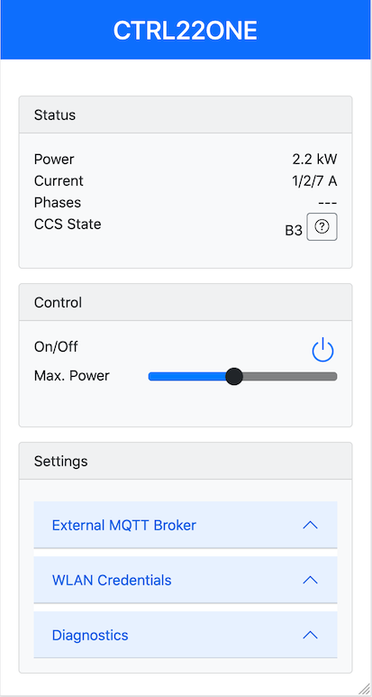

# Arduino Firmware ESP32/AVR

In parallel to our main intent to organise a network of charging station, we plan to provide a simple solution for a stand-alone configuration, utilising the commonly accepted Arduino programming environment. This repository is organised as follows:  

- [ctrl22one](./ctrl22one) is an Arduino sketch to run the ESP32 as a remote control for a single charging station
- ctrl22.ino will become an Arduino sketch for drop-in replacement of our ctrl22.c firmware [not yet started] 

**DISCLAIMER**. Obviously, this is a side-rack to our original project and we run this at low priority.

## ESP32 firmware based on ESP32 Arduino Core

Easy to use remote control and monitoring Web GUI, all implemented stand-alone in the ESP32. No external server required, no internet gateway either, i.e, this also works if you decide that you home automation WLAN can not reach the internet. Optionally, you can configure the ESP32 to forward monitoring to an external MQTT broker. This is how it looks (more details [here](./ctr22one/)):

 

## AVR firmware base on Arduino XMegaCoreX 

[nothing ready to share at this point of time -- not sure, how to go with this, in particular the current measurement]

