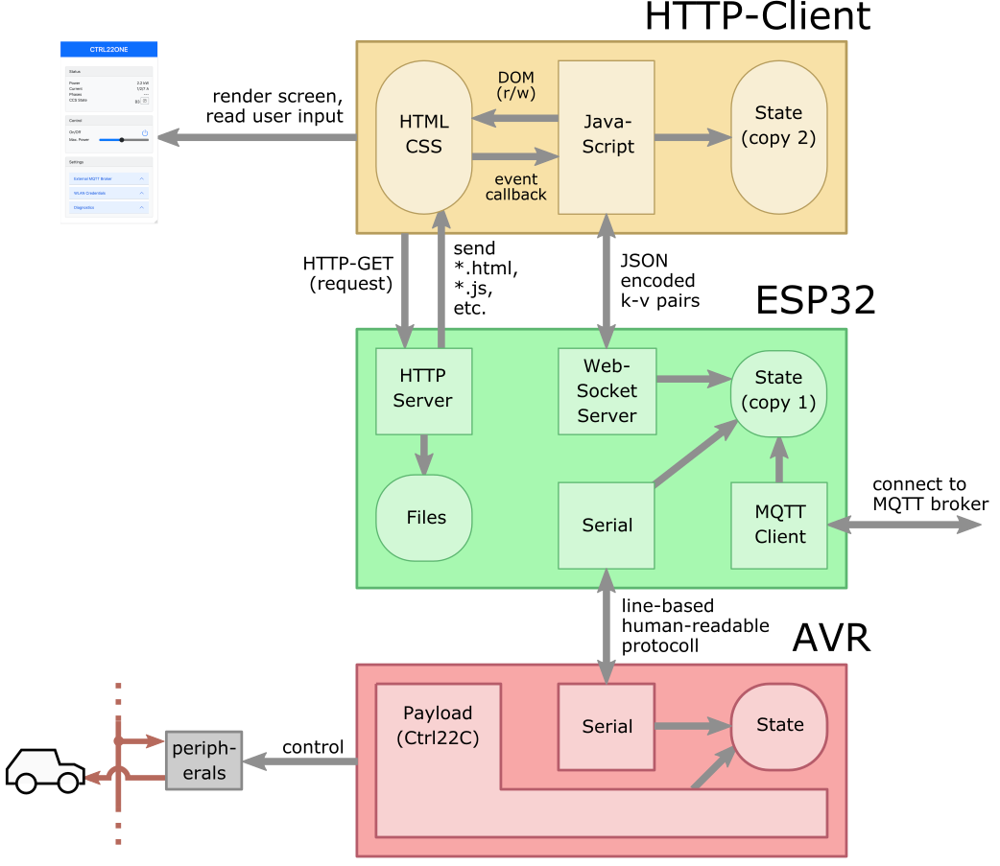

# CTRL22ONE

Web-GUI for the control of a single AGCCS-CTRL22 board in standalone configuration, i.e., no wifi-mesh, no load balancing. The motivation here is to have a convenient basis to fine-tune the AVR firmware [Ctrl22C](../../ctrl22c/) to cope with a variety of different EVs with different sleep/wake-up behaviour and such. We do log to a configurable MQTT broker and accept dynamic power allocation. This could be interesting for charging at home from solar power when available and/or to otherwise integrate the device with existing home automation infrastructure.

**DISCLAIMER.** Although generally in a good shape, this is still work in progress. Specifically, there are a number of diagnostic features that should be disabled in a production set up.


## Key Features 

- simple Web GUI to start/stop charging, limit the maximal available power and to monitor the actual current drawn;

- maintain WLAN credentials in EEPROM; alternatively, provide an WLAN access-point and ask the operator to provide valid credentials via the Web GUI;

- everything built-in, no RasPi required for basic operation;

- convenient over-the-air (OTA) upgrade via the Arduino IDE; 

- optionally forward status reports to an MQTT broker (configurable via the Web GUI)

  

## Implementation Outline

The ESP32 firmware ``CTRL22ONE`` implements a simple HTTP server to handle GET requests. It serves "static text files" which are encoded as strings in PROGMEM. There is one main page ``index.html`` which provides a reactive GUI based on [jQuery](https://jquery.com/)/[Bootstrap](https://getbootstrap.com/). Here, _reactive_ reads that individual GUI elements adapt their look and feel as expected and without further coding on our side; i.e., accoridion stacks magically collapse and expand on user interaction. Also the layout mechanism adapts to the screen size and the GUI should be usable both on desktops and on mobile devices. However, for dynamic content elements such as sliders and gauges we do have to code a little. The JavaScript embedded in  ``index.html`` connects to a websocket on the ESP32 and forwards any changes of control and or configuration parameters to that socket. The ESP32 in turn is responsible to forward appropriate control to the target AVR and/or to adapt its configuration. 



## Build Process 

Load the sketch in the Arduino IDE, compile, download, done. Some considerations:

- install the third party components listed at the bottom of this page; use the board manager for the ESP32 Core and the library manager for the remaining libraries; they all come with GitHub documentation incl. installation instructions; regarding the various JavaScript libraries, you do not need to bother as long as you are happy with the versions included in the source tree; 

- you can conduct first tests with an M5StickC or an ESP32 dev board; observe the respective  `#define`directives the beginning of the sketch;  you will need a *J5-Programming-Adaptor* to program the AGCCS rev 1.2 board (see [circuit](../../circuit)); regarding the Arduino IDE, the AGCCS board can be configured as "ESP32 dev board";

- TSL can be activated as a compile-time option via ``#define USETSL``; this has both a memory and a performance impact, so you may want to begin tests without TSL enabled; if you take TSL serious, you will want to generate you specific keys; this can be done by the script `mkcert.sh`;

- before flashing via the Arduino IDE be sure to choose "large APP, minimal SPIFS, with OTA" as partition table (_Tools_-menu); on a common 4MByte ESP32 this gives us about 1.9MByte for our application and we should be fine with that; if not, we can get ESP32s with up to 16MByte;

- the sketch is rather verbose on the serial line, so the serial-monitor can be utilised to locate issues if any;

- for simplicity, we opted to embed the files served via HTTP as PROGEM strings as opposed to a SPIFFS filesystem in a seperate partition; on the downside, we need to care about converting the original text files into respective C-header files need; see below; on the first take, you can ignore this step and go with the provided C-headers;

- the target AVR firmware is expected at `./avrfrm/ctrl22c.bin` and is embedded to PROGMEM in the same fashion as the static HTML/CSS/JS files; it has to be compiled to load at 0x0200, i.e., 512 bytes offset to accommodate Optiboot; the Makefile provided with [Ctrl22C](../../ctrl22c/) takes care about this details; to update the AVR firmware, you'll effectively need to re-comipile the ESP32 firmware; this has some relevant practical pros: only one firmware image to distribute.

  

## First Installation

Assuming that you have compiled an downloaded the Arduino sketch on either an M5StickC, some other ESP32 dev. board, or the actual AGCCS-CTRL22 board, the ESP32 will attempt to connect with your wireless network --- and fail, how should it know the secret credentials? Therefore, the ESP will turn to access-point mode and span its own WLAN with SSID `agccs-^XYZ^` with `^XYZ^` derived from the MAC address and with password _ctrl22one_. You should be able to join this network with a laptop or mobile device. In this mode, the Web GUI can be accessed at address 192.168.4.1, i.e., type http://192.168.4.1 in the address bar of you browser. To configure the device observe the collapsibles 

- _System Settings_ to set the installed power the device name; the latter overwrites the default `agccs-^XYZ^` used as SSID when in access point mode;
- _WLAN credentials_ to set the SSID and the WPA2 password of your wireless network; note the ESP32 can only join 2.4GHz networks.

To take on the new configuration press `Restart`. 

 


Once restarted, the ESP32 will succeed in joining your wireless network. Depending on your router, you can access the ESP32 via a symbolic address derived from the device name chosen above (e.g. our AGCCS-CTRL22 board is accessible by the address http://ctrl22one.local when connected via a FritzBox; other routers may require manual configuration).

Thats all to it -- you can now control the AGCCS-CTRL22 board via any browser, incl. your favourite mobile device. If you still have the Arduino IDE open and the J5-adapter connected, you can observe the verbose output via the serial monitor. Alternatively, any status reports from the AVR serial line are forwarded to the _Diagnostics_ collapsible in the Web GUI. So there is plenty of internal monitoring to provide a comfortable basis for you further development so that you can indeed tailor the device to your very needs and preferences.


## Remote Control via MQTT 

To configure the details of the external broker and a root topic `^TOPIC^`, use the"External MQTT Broker" collapsible from the Web GUI. The device will then periodically publish its state to `/^TOPIC^/heartbeat` . The message is JSON encoded and follows the same scheme as our main. To inspect the heartbeat, subscribe to the same broker, e.g., using mosquitto 

```
$ mosquitto_sub -h lrt -p 1883 -t /^TOPIC^/heartbeat 
```

where the the broker running on the host _lrt101_ at the default port 1883. Messages received have the format

```{"aphases":0,"amaxcur":0,"ccss":3,"cur1":-1,"cur2":-1,"cur3":-1,"sphases":1,"smaxcur":174,"sonoff":1}```
{"aphases":123,"amaxcur":160,"ccss":33,"cur1":158,"cur2":0,"cur3":0,"sphases":1,"smaxcur":174,"sonoff":1}
```

where

| Parameter        |                                                              |
| ---------------- | ------------------------------------------------------------ |
| aphases          | actually enabled phases in decimal encoding, e.g. 123 for all three phases |
| amaxcur          | actually maximum current allocated to the EV in the unit [100mA]; e.g. `"amaxcur":160`for 16[A] |
| ccss             | CCS state, 0-9 for OFF, 10-19 for A (wait for car), 20-29 for B (wait for car ready to charge), 30-39 for C (do charge),  40-49 for P (pause), 50-59 for W (wait); see [Ctrl22C](../../ctrl22c/) for details |
| cur1, cur2, cur3 | actual current drawn from either phase L1, L2 and L3 in [100mA]; i.e. `"cur1":10`for 1[A] on L1; when no valid measurement is available, the parameters real `-1` |
| sphases          | phases allocated by a remote host in decimal encoding; this may differ from `aphases` for several reasons, e.g., a remote host may enable phases which are physically not installed |
| smaxcur          | current allocated by a remote host in the unit [100mA]; this may differ from `amaxcur`, e.g., because the cable has less capacity or because the physical installation limits the power available; |
| sonoff           | reads `1` for normal operation or `0` if charging is paused by an external host; |


Likewise, the unit subscribes to  `/^TOPIC^/control` and expects JSON encoded messages in order to remotely control the device. Currently, you write to the parameters `sphases` and `smaxcur` by messages in the format `{"sphases":^X^,"smaxcur":^Y^}` where `^X^` are the phases to be enabled and `^Y^` is the allocated current.


**Note.** The MQTT library we use blocks for about 20 seconds when it connects to an MQTT broker which is unavailable and it will retry every 60 seconds. When using MQTT as the only means of interaction, this is not an issue. However, the Web GUI will be inaccessible during this period of time. This issue has been reported with a number of MQTT libraries. The proper way to fix this is to run a separate task for MQTT or to resort to a fully asynchronous MQTT library. For the time being, we wanted to keep things as simple as possible.


**Note.** At the current stage, our implementation runs MQTT without any encryption. You should hence only use this feature in a dedicated local network. 


## Editing/Testing Static HTML/CCS/JS Content

Static content to be served via HTTP resides in the subdirectory `./websrc/*` in the source tree. Of formost interest are the files `index.html` and `style.css` which define the appearance of the GUI. Next, there are various `*.js`/`*.css` files for our local copy of jQuery/Bootstrap & friends. To test/develop the HTML/CSS/JS configuration, simply load `index.html` by _Open File_ in your preferred browser --- thats it. Although you'll get a warning because there is no websocket to connect for live data, you can still inspect the GUI incl. the effects of various CSS parameters. Feel free to rearrange the layout, remove/add elements, change colours a.s.o. 

Once happy with the general appearance of the GUI, we need to have the ESP32 effectively to serve the content of `./websrc`. The scalable solution here would be to have a filesystem (e.g. SPIFFS) on the ESP32 and to transfer the files to that filesystem. There are two cons to this approach: (a) given the small number of read-only files to serve, a full filesystem is overkill; (b) if we apply changes, we most like do so uniformly to the application firmware and the GUI. Therefore we opted to embed the text files as PROGMEN strings into the firmware. For this reason, we need to convert all static content files into C-headers which define an equivalent constant C-string. E.g., `index.html` is converted to `index.html.h` reading out

```
PROGMEM const char f_index_html[] = {
  0x3c, 0x21, 0x44, 0x4f, 0x43, 0x54, 0x59, 0x50, 0x45, 0x20, 0x68, 0x74,
  [ ... many more similar lines ...]
  0x62, 0x6f, 0x64, 0x79, 0x3e, 0x0a, 0x0a, 0x3c, 0x2f, 0x68, 0x74, 0x6d,
  0x6c, 0x3e, 0x0a, 0x00
};   
```

Note that although the converted file is considerable larger than the original text file, the effective memory footprint in the ESP32 obviously remains the same. By convention, each text file in `./websrc` is accompanied by an equivalent C-header in the neighbour directory `./headers`. When editing the text files, we will need to update the headers. The core conversion is done by the command-line tool `xxd`, available for OSX/Linux/Windows. Except for Windows, we provide the shell script `mkheaders.sh` to facilitate the conversion and to add appropriate decoration (i.e.. C-variable names are prefixed `f_` and are of C-type `const char` with the directive `PROGMEM`). When invoked with no arguments, `mkheaders.sh` will convert all files found in `./websrc`and place the result in `./headers`. Example:

 ``` 
 $ cd {WHERE-EVER}/agccs-ctrl22/arduino/ctrl22one
 $ ls ./websrc
   index.html style.css jquery.min.js [... and so on ...] 
 $ ./mkheaders.sh 
 $ ls ./headers
   index.html.h style.css.h jquery.min.js.h [... and so on ...] 
 ```

[This type of conversion seems to be a frequently required build step; is there perhaps a Python script to do this in a platform independant manner so we can take the Windows users on board?]

 

## Third Party Components 

We usually prefer to code directly on top of the ESP-MDF/IDF SDKs and we do so for good reasons. However, we must admit that within the Arduino environment a functional prototype can be obtained with far less effort. One aspect here is that the ESP32 SoC is considered sufficiently powerful to trade in some resources in favour for a modern C++ coding style (think of string manipulation and/or JSON parsing). But the major share of the experienced convenience is owed to the readily available libraries with their intuitive high-level APIs.  Specifically

- [ESP32Core](https://github.com/espressif/arduino-esp32) 1.0.6 (lots of contributors, Espressif)
- [WebSockets](https://github.com/Links2004/arduinoWebSockets) 2.3.5 (Markus Sattler)
- [ESP32_HTTPS_Server](https://github.com/fhessel/esp32_https_server) 1.0.0 (Frank Hessel)
- [MQTT](https://github.com/256dpi/arduino-mqtt) 2.5.0 (Joël Gähwiler)
- [ArduinoOTA](https://github.com/jandrassy/ArduinoOTA) 1.0.6 (Juray Andrassy, Arduino)
- [ArduinoJson](https://arduinojson.org/) 6.17.3 (Benoit Banchon) 

You will need to install all of the above in oder to build our Arduino sketch. Be aware that there typically exist multiple libraries for the same topic but with different APIs, different features, and at different stages of maturity. Be sure to get exactly those listed above, higher version numbers should be fine in most cases.   

Likewise, on the HTML/CSS/JavaSkript side we did not need to start from scratch. It can be be really cumbersome to try to learn the technical details on how hundreds of modern CSS properties and HTML elements interact. None of this should be of our concern: Boostrap & friends wrap it all up with a nice top-level interface, no need to worry --- thank you. All of the below are included in minimal distribution form in our source tree, so you do only need to bother if you want to update to a newer version.

- [jQuery](https://jquery.com/) 3.6.0 (OpenJS Foundation) 
- [Bootstrap](https://getbootstrap.com/) 5.0.0-beta3 (Bootstrap Team)
- [Bootstrap-Slider](https://github.com/seiyria/bootstrap-slider) 11.0.2 (lots of contributors, maintained by Kyle Kemp and Rohit Kalkur)