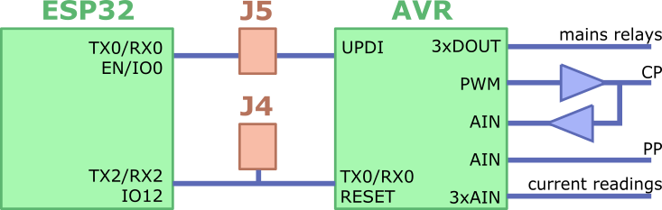

Circuit
=======

The schematics used in this project have been adopted from the [SmatEVSE project](https://github.com/SmartEVSE) with a number of modifications in order to

- have an AVR uC from the ATmega series to attract developers from the Arduino community;
- have an ESP32 for networked wireless communications;
- enable/disable any of the three supply phases seperately for improved load balancing;
- integrate power monitoring for improved load balancing;
- layout with hand soldering in mind so we can build our own.

The original adaption to our requirements was developed in course of a BA thesis at FAU/Erlangen and has been published in [this project](https://github.com/dreadnomad/FGCCS-Ctrl22). The present repository is a strip down to the essentials. You may want to inspect the original sources; in particular the [BA thesis](https://github.com/dreadnomad/FGCCS-Ctrl22/blob/master/doc/Bachelorarbeit_Pascal_Thurnherr.pdf) includes a convenient summary of the electrical specifications from the CCS standard IEC-62196, as far as relevant for the project at hand.


# Theory of Operation in a Nutshell

We use an ATmega 4808 AVR uC to control the charging process. Its core tasks are to

- operate the mains relays to turn on/off individual phases of the charging outlet;
- generate the control pilot signal (CP) to indicate to the car the amount of power available;
- read back the buffered CP signal to figure the status of the car (e.g. present, charging);
- read the proximity pilot (PP) to figure the current limit implied by the charging cable;
- read the current actually drawn.    



For the AVR, we provide the firmware [../ctrl22](../ctrl22/) which is controlled via a simple human readable protocol on the serial port TX0/RX0, accessible via J4 for development/testing/configuration. **Note that our circuit is 3.3V and you will hence need a 3.3V USB-to-serial converter or a suitable level shifter to access J4.** Once configured, the AVR safely controls the charging process in a stand-alone fashion. The optional ESP32 is utilised to set up a wireless mesh network such that a remote server can configure the AVR, e.g. set power limits, enable/disable individual maines phases.  The programming header J5 is used to bootstrap firmware installation (details given below). Once set, further firmware updates can be organised by the remote host, e.g., by the utility`dmctrl.py`; see [../utils](../utils/). 


# Installing Firmware (first time only)

To get bootstrapped, we need to install an initial version of firmware for both the AVR uC and the ESP32 SoC. For this purpose, our board is equipped with the custom 8-pin header J5

| Fnct.    | Pin | Pin | Fnct.     |
|:--------:|:---:|:---:|:---------:|
| AVR-UPDI |  1  |  5  | GND       |
| ESP-TX0  |  2  |  6  | 3.3V      |
| ESP-RX0  |  3  |  7  | ESP-IO15  |
| ESP-IO0  |  4  |  8  | ESP-EN    |


### AVR Firmware/Bootloader

The ATmega4808 used in our project is a modern incarnation of the ATmega series, and in many aspects more closely related to the XMega series. In particular, it is natively programmed via the so called  UPDI one-pin interface. The official programmer Atmel ICE ($100+) works fine with Atmel AVR Studio and provides professional grade debugging facilities. However, at the time of writing) it is not well supported by mainstream `avrdude`. Fortunately, the [`pyudpi`](https://github.com/mraardvark/pyupdi) project provides a low-cost alternative which only needs an of the shelf USB-to-serial converter and a single 4.7K resistor --- and which we used with no problems at all on Mac OSX and Linux. **Again: you will need a 3.3V USB-serial converter**.


Short instructions:

- set up the wiring
  ```
  USB-Serial-TX>---[4.7K]--->+<>AVR-UPDI (aka connector J5 pin 1)
                             |
  USB-Serial-RX>-------------+
  USB-Serisl-GND<>------------<>GND  (aka connector J5 pin 5)
  ```
  
- get `pyudpi` from Github

- install python add-ons `intelhex` and `serial`, e.g.
  ```
  sudo pip install intelhex
  sudo pip install serial
  ```
  
- get some device specs and check the connection
  ```
  pyupdi.py -d mega4808 -c /dev/{SOME_USB_SERIAL_DEV} -b 115400 -i
  
  ```
  
- program flash memory, e.g. the Optiboot bootloader

  ```
  pyupdi.py -d mega4808 -c /dev/{SOME_USB_SERIAL_DEV} -b 115400 -f {OPTIBOOT_FOR_ATM4808}.hex
  ```

Although you can flash any firmware via the routine described above, we need a bootloader for our project such that later firmware updates can be organised remotely. We use Optiboot for its compliance with the Arduino toolchain. Get your original copy of [Optiboot](https://github.com/Optiboot) or use the `.hex` file provided in our repository. 

Missing Topic:_ how we set the fuses for our project  


### ESP32 Firmware

The ESP32 SoC is more advanced than a plain AVR uC. It has a built in two-level bootloader and is programmed via the serial interface TX0/RX0. To enter bootloader mode, IO0 must be set low at the time when EN becomes high (EN acts as inverted RESET, and IO0 selects the bootmode).

Short instructions:
- set up our ESP32-MDF SDK and compile the firmware `demesh`; see [../demesh](../demesh/) for instructions
- set up our wiring
  ```
  USB-Serial-TX>------------->ESP-RX0  (aka connector J5 pin 2)
  USB-Serial-RX<-------------<ESP-TX0  (aka connector J5 pin 3)
  USB-Serisl-GND<>---+------<>GND      (aka connector J5 pin 5)
                     |
                     +-[/]--<>ESP-IO0  (aka connector J5 pin 4)
                     |
                     +-[/]--->ESP-EN   (aka connector J5 pin 8)
  ```
- to flash the `demesh` firmware
  - set ESP-EN and ESP-IO0 to low
  - set ESP-EN to not-connected
  - run `make flash`
  - set ESP-IO0 to not-connected
  

This is effectively the same procedure as with common ESP32 dev-boards such as NodeMCU, except that dev-boards will have convenient key-switches built-in while we need to do some external wiring. 


# Developing/Testing AVR Firmware

Assumimg that you have installed Optiboot as described above, application frimware development can be done via the J4 header in Arduino style, i.e., serial debugging via a terminal emulation and frimware flashinh via `avrdude -carduino` over the same serial line. If you go this path, we recommend you set up a simple adaptor, e.g.

```
USB-Serial-RX<-------------<AVR-TX0  (aka connector J4 pin 2)
USB-Serial-TX<-------------<AVR-RX0  (aka connector J4 pin 3)
USB-Serisl-GND<>---+------<>GND      (aka connector J4 pin 1)
                   |
                   +-[/]--<>AVR-RST  (aka connector J4 pin 4)

```

However, if you have installed the ESP32 with the provided firmware `demesh`, there is a more convenient and --- given that we are running on maines power --- more safe alternative. On power-on, `demesh` reads a configurable IO pin (default IO15) to choose to boot into target-development mode. In this mode it will not setup a wifi mesh network but instead act as an accesspoint and provide a transparent telnet passthrough of the AVR serial port TX0/RX0 incl. the Optiboot bootloader. Thus, we can develop/test the AVR firmware largely independantly from the more involved wifi mesh but still have the convenience of "no wires from the charging station to my computer".

After connecting with the access point, the debug server can be accessed via

```
gtelnet 192.168.4.1
```

The IP address, the SSID and the WPA2 password are configured within `demesh`; see [../demesh](../demesh/)
To inspect available commands for the provided AVR firmware, type `? [CR]`. To exit the session, 
type `Ctrl-Q` or `Ctrl-D`.

To access the AVR bootloader, the alternative port 2323 is provided. On connections, it resets the AVR to enter Optiboot an can thus be programmed via `avrdude -carduino`. Example 

```
avrdude -patmega4808  -carduino -Pnet:192.168.4.1:2323 -U flash:w:{SOME_HEX_FILE}.hex
```


**Note:** In contrast to the classic ATmega architecture, the ATmega4808 has the bootloader in low address range, e.g. Optiboot from 0x0000 to 0x01ff. Thus, application firmware needs to load at 0x0200. This needs to be made explicit when compiling the firmware, e.g., with the linker directive `--section-start=.text=0x200`. The `makefile` provided with our firmware [../ctrl22](../ctrl22/) will take care about this detail.  


# Hardware Revisions

In this repository we currently provide the develoment version Rev-1-2 as an editable KiCad project and the schematics of Rev-1-1 for inspection. We are currently running a modded variant of the initial Rev-1-0 for evaluation purposes. We expect to finalise and test Rev-1-2 in very near future.


Revision 1.1

Schematics
- seperate terminals J1/J2 and J6/J7
- additional protection BAT54S for analog inputs CP, CT0-CT2
- improved pinout of J5 and J4 (programming headers)
- improved pinout on J6/J7 and J1/J2 (simplify external wiring)
- reduced lock resistor from 50 to 25
- clear indication of C16 polarity
- reduced current on button-press

Layout
- fixed footprint of power supply
- placed ESP32 on backside
- track back changes in the schematics


Revision 1.2

Schematics
- jet again the push button electronics ...
- added a diode to seperate lock from 12V supply (brown out)


