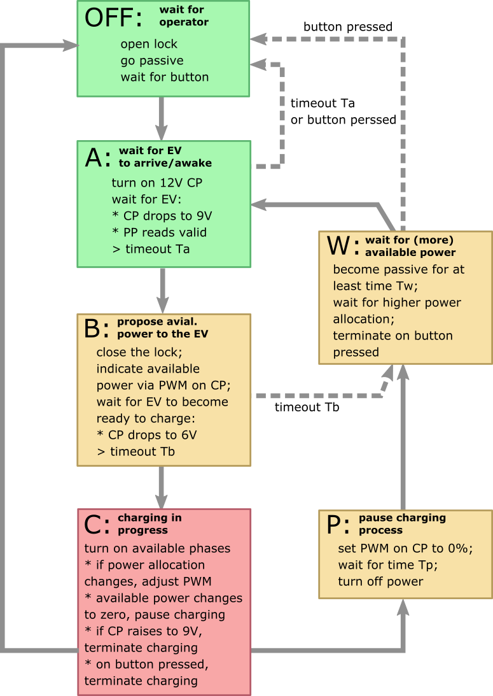

# Ctrl22 --- AVR Firmware

Our firmware for the AVR uC ATmega4808 controls the charging process according to the CCS standard. For details of the circuitry, see [../circuit](../circuit/).  The code is organised in a cyclic fashion, i.e., there is one indefinite while-loop which runs a number of callback functions which actually operate the attached hardware modules (e.g. generate control pilot CP, read back CP, read proximity pilot PP, operate mains relays, measure current, etc.). The firmware is controlled via the TX0/RX0 serial line with a line-based human readable protocol. In our project, this control is exercised by an ESP32 SoC to allow for remote access. For development, we propose to set the ESP32 in target AVR development mode in order to forward the AVR's TX0/RX0 via telnet; see [../circuit](../circuit/) for details.

## Organization of the Charging Process

The established way to charge an EV according the relevant CCS specification is organised in three stages: 

- (A) wait for the car to plug in the cable;
- (B) lock the charging cable, indicate available power, and wait for car to be ready to charge;
- (C) forward the mains power to the car

If the maximum available mains current and the allocated phases do not change, this is exactly how our firmware behaves. However, when allocating the power dynamically, we need to take some extra precautions. The below proposal is an early draft and we expect some further tweaks to be required. To this end, it should work out fine for static power allocation.

You can inspect the implemantation of this state machine in the callback function `ccs_cb()`. A typical cycle time of our main loop is about 5ms depending on the workload, the maximum should be below 10ms. An indicated above, the individial components are again addressed via callback functions. That is, whenever `ccs_cb()` e.g. needs to know whether the operator button has be pressed, it will read the global variable `g_button` and trust the respective callback function `button_cb()` to set this variable accordingly. By convention, global variables are prefixed `g_` and callback functions are suffixed `_cb()`. Our main indefinite while loop consists of a list of callback functions which interact via dedicated global variables, i.e., the relevant state of the overall program.

- `systime_cb()` updates  `uint16_t g_systicks` to a system time in ms ticks with a convenient rollover at 2^16-1; we use`g_systicks` extensively to schedule timeouts without getting locked; there is also a variant `g_systime` with a rollover at 30000 to facilitate a synchronisation of seconds;                                     

- `monitor_cb()` is for debugging purposes, it monitors the maximum cycle time so that we can be sure to be below whatever our target is at this end;

- `led_blinks_cb()` flashed the operator LED as often within a 2 second period as specified by `g_blinks` (relevan range 0 to 20 with some cosmetic additional flash-patterns); thus, in CCS state 'OFF' we may set`g_blinks=1` for one tame flash every 2 seconds while we may use higher values to indicate actual charging to the customer;  

- `lock_cb()` operates the lock accroding to `g_lock_st`; the latter is an enum to encode `open`, `closing`, `closed` and `opening`; for convenience, there is a setter `lock(1)` to initiate closinf and `lock(0)` to initiate opening; the callback then operates the solenoid according to its schedule; 

- `button_cb()` sets `g_button` to `true` when a positive edge has been detected; it will be reset in the subsequent loop;

- `rms_cb()` keeps updating the RMS measurement of the actual current; it triggers a 10kHz interupt to take samples and subsequently organosises RMS computation in short slices; eventually, `g_cur1`, `g_cur2` and `g_cur3` will be updated accordingly; the convenenience functions `rms(1)` and `rms(0)`  enable and disable RMS measurement, respectively.

- `pilots_cb()` keeps updating synchronous analog reading of pilots to` g_cpilot` (scaled in [V]) and `g_ppilot` (conveniently scaled in [100mA] read back); again, pilot reading is enabled/disabled by  `pilots(1)`/`pilots(0)`;

  

## Serial Line Protocol

The AVR organises its operation by a dedicated set of state variables. Relevant subsets of these variables can be read from or written to the serial line. The protocol is as follows.

- to read the parameter `<PAR>`, send `<PAR>?\r\n` to the AVR; expect a reply in the form ` <PAR>=<VAL>\r\n`, or `fail` for parse error; here `<PAR>` the printable ASCII name of the parameter and `<VAL>` is  a signed 16bit integer in common decimal ASCII representation;
- to write the parameter `<PAR>`, send `<PAR>=<VAL>\r\n` to the AVR; expect a reply in the form ` <PAR>=<VAL>\r\n`, or `fail` for `parse error`; here `<PAR>` and  `<VAL>`  are ASCII encoded name and value of the respective parameter as indicated above;
- semantic suger: send `<PAR>!` to set the value to `1`, or  `<PAR>~` to set the value to `0`.

The protocol is strictly line based. That is, the host sends one line and expects one line as reply. This is to facilitate parsing on host side, which in our use case is done by the attached ESP32.

**Examples for the purpose of dymanic power allocation**

| Send to AVR       | Receive from AVR  | Comment                                                      |
| ----------------- | ----------------- | :----------------------------------------------------------- |
| `ver?/r/n`        | `ver=14/r/n`      | read firmware version v1.4                                   |
| `cmaxcur?/r/n`    | `cmaxcur=160/r/n` | read charging cable capacity 16.0A (-1 for no car detected)  |
| `smaxcur=160/r/n` | `smaxcur=320/r/n` | set maximum available current to 32.0A                       |
| `amaxcur?/r/n`    | `amaxcur=160/r/n` | read maximum current actually allocated to the vehicle       |
| `phases=12/r/n`   | `phases=12/r/n`   | enable mains phases L1 and L2, i.e., decimal encoding        |
| `cur1?/r/n`       | `cur1=65/r/n`     | read 6.5A as current drawn on phase L1; likewise phases L2 and L3 |

Optional convenience commands are implemented on top of this strict scheme. The AVR replies on such commands are escaped with a beginning line `[[[\r\n` and trailing line `]]]\r\n`. Currently, there is only one such convenience command, namely `?\r\n` to request an overall system status --- and the exhaustive list of all accessible global variables. 

For the sake of simplicity, the AVR is passive, i.e., if we want a regular update on some aspects of its state, we need to poll. Exceptions are

- various debug switches in our current revision will generate informative lines of unsolicitated rumble that begin with the special character `%`
- for future revisions, we may send status data (e.g. drawn current) by single lines that begin with the special character `[` and that end with `]/r/n`.

Thus, our ESP32 firmware shall filter any lines that start  `%` an optionally interpret lines that start with `[` .

## First Installation

The firmware supports some commands via the serial line that are specifically meant to facilitate first installation. For this purpose, it is recommended to power the circuitry via a 12V bench supply and to test individual functional modules separately with dedicated test peripherials attached.

**Operator LED.** Connect the LED anode to +12V and the cathode via a suitable resistor to the LED-terminal; 500R should be fine for a "standard" 2V/20mA red LED. On power up, the device will blink at a 2sec period to indicate its status. When observing continuously flashes at high frequency, this indicates an error state. On first-installation, the reason is presumably an EEPROM checksum error. This is to be fixed by saving the default parameters (command `save!\r\n`) . 

**Operator Button.** Connect the button to +12V and to the BTN-terminal. On button press, the firmware transitions to EV detection. This is indicated by changing the blink pattern of the LED to a smooth 0.5Hz blink. 

**Signal Relay.** By default, the signal relay is off. To turn it on, use  `sigrel!\r\n`. This is required for the following tests of the proximity signals. You should now observe +12V at the CP-terminal.

**Proximity Pilot.** Enable periodic pilot reading by `pilots!\r\n`. If nothing further is connected, `cmaxcur?\r\n` should read 130 (i.e. 13.0A). When connecting the PP-terminal via a 220R resistor to ground, `cmaxcur?\r\n` should read 320 (i.e. 32.0A). In the case the `DEBUG_ADC` macro is defined, the periodic reading of all pilots will be forwarded to the serial line, incl. the actual ADC count.

**Control Pilot (reading).** Enable periodic pilot reading by `pilots!\r\n`. If nothing further is connected, `cpilot?\r\n` should read 12 (i.e. 12V). When connecting the CP-terminal via a diode and a resistor 2.7K to ground,`cpilot?\r\n` should read 9 (i.e. 9V). When adding a 1.3K resistor in parallel `cpilot?\r\n` should read 6 (i.e. 6V). The voltage readings should match the voltage at the CP-terminal, i.e., use a meter to check back. 

**Control Pilot (generating)**. Use e.g.  `cpcur=320\r\n` to generate a 1kHz PWM signal corresponding a maximal current of 32A. The amplitude should be +/-12V. Use a scope to check back. If nothing further is connected, `cpilot?\r\n` should read 12 (i.e. 12V). When connecting a diode and a resistor to the CP-terminal as described above, only the positive voltage should be affected.

**Lock.** The lock terminals W and R should be at 12V. When closing the lock by  `lock!\r\n` the W terminal drops to 0V for about 100ms. If no lock is connected, this will result in a lock-error. Use   `reset!\r\n` to reset the device if you want to repeat the test. Before connecting a lock, figure the wiring (color codes differ from lock to lock). For opening the lock, use  `lock~\r\n`.

**Current Reading.** Use  `rms1!\r\n` to trigger a single reading of the RMS value for mains phase 1. The respective terminals are CT1-L and CT1-K. Here, CT1-K is a 1.65V bias (check with a meter) and CT1-L is the AC signal induced by the current transformer. If nothing is connected, `rms1?\r\n` should read 0 modulo noise (typical values observed are no more than 4). If the macro `DEBUG_RMS` is defined, the reading incl. the ADC count will be automatically forwarded to the serial line. For further testing, you may attach a signal generator with a 50Hz sine and e.g. 100mV amplitude, and check for `rms1?\r\n` to read 71 (i.e. 71mV). There are two cases for consideration. If the signal generator is not grounded, you may connect directly to the CT1-L and CT1-K terminals. If, on the other hand, the generator is grounded, you connect live to CTL1-L and ground to GND. Here, you need to configure the generator to produce 1.65V offset --- otherwise, the negative half-wave may damage the ADC in the AVR. Note that built-in signal-generators in scopes for usual are grounded.   

**SSRs.** To test the SSRs you will need to run the device on mains (caution!). `ssr=1\r\n` should turn on the SSR for phase 1. When a contractor is connected to terminals C1-N and C1-L, it should be activated. `ssr~\r\n` should then deactivate the contactor. This part of the circuitry is fairly simple and should need no further attention. We recommend not to test the SSRs beforehand and to defer this step until the entire unit is safely placed within an enclosure.

## Compiling/Programming the AVR

We provide a `Makefile` that should be easily adaptable to Linux/MacOSX programming environments. The easiest way to get a recent AVR toolchain is to install the Arduino IDE and to figure the path of the relevant binaries. A simple `make` on the command line will then produce the binaries `ctrl22.bin` and `ctrl22.hex`. The fromer is required when updating firmware over the wireless mesh network (see [../demesh](../demesh/)), the latter when using `avrdude` via telnet or the J4 header (see [../circuit](../circuit/))

The code itself has a number of debug switches right at the beginning which we use for "serial line debugging". If e.g. there are issues with the lock, it is worth turning on `#define DEBUG_LOCK`; or use `#define DEBUG_CCS` to track progress in the CCS state machine depicted above.

