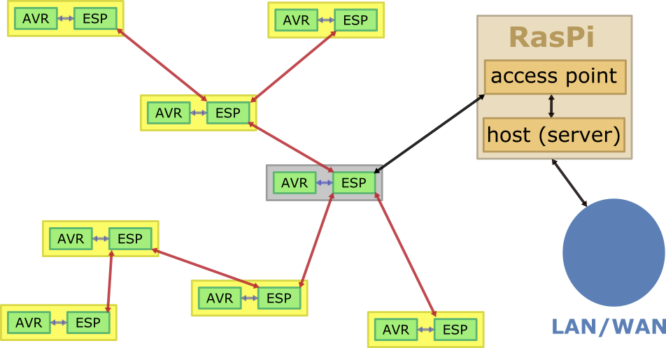

# Demesh --- ESP Firmware

In a nutshell an ESP wireless mesh network (MWifi) is organised as a tree of nodes which pass on messages to their direct parent or children. This is a completely different story than common Wifi, where each station communicates directly with the access point. In particular, there are neither TCP sockets,  UDP telegrams or IP addresses in a MWifi. Benefits include a larger coverage without dedicated repeaters and a lower power consumption. The tree will dynamically reconfigure itself dependent on channel quality. This all sounds very involved and indeed is so. However, Espressif provides a ready-to-go SDK and all the magic happens under the hood; see [ESP-MDF on GitHub](https://github.com/espressif/esp-mdf), including a large number of getting-started examples, and/or the [reference documentation](https://docs.espressif.com/projects/esp-mdf/en/latest/?badge=latest).


## An MWifi to Control Attached Target uCs


For our specific setup, we want to address the following network architecture 




Each node consist of an ESP32 SoC with an attached ACR uC, also referred to as the target uC. The red arrows indicate communication via the MWifi. Each node is addressed by a unique part ID of the ESP32 which otherwise acts as a MAC address. Via this address each node can send a message to any other node, the MWifi will take care about routing. One node allthough is special, namely the root node given in grey colour. On the one hand it acts like all other nodes in that it can send messages via MWifi. But it also operates in station mode as part of an ordinary TCP/IP Wifi. It our application it utilises this secondary role to built up a TCP/IP connection to a predefined server port on the host and (a) takes commands from the host to be forwarded to specific nodes and (b) forwards messages from any node to the host. With this infrastructure the ESP32 firmware `demesh.c` implements the following basic functionality

- each ESP32 gathers on a regulat basis relevant aspects of the state of the respcetive target uC and composes a _heartbeat_ _message_ to be forwarded to the root node;
- the root note forwards heartbeat messages to the host;
- the host gathers the overall status of the network and, on a regular basis, issues appropriate commands to each individual node (e.g. power allocation for an attached EV charging station); in turn, the node forwards the commnd to the target uC.

Effectively we tunnel the serial line of the target uC to the host. To be of practical use we also provide some convenience features

- we synchronize systemtime such that our charging stations can flash their operator buttons nicely in sync;

- as an alternativ to plain TCP/IP sockets, the root not also publishes the hearbeat messages to an MQTT broker and  subscribes to command messages;

- we allow to update the ESP32 firmware over the air (OTA);

- we allow to update the target uC firmware OTA; for this, the host first forwards the desired firmware image to the ESP32 which in turn runs an implementation of the Optiboot (subset of STK500) programmer emulation.

  


## Implementation Overview

The ESP32 is quite a powerfull SoC, providing two cores and 380kB RAM. The ESP-MDF SDK is built on to of the FreeRTOS operating system and we thus have taks, timers and socket IO. Indeed, programming the ESP32 feels much more like programming a POSIX compliment "System" than just a "Chip". We give run through of the main building blcoks of the provided firmware with a focus in message forwarding

**Upstream Link -- Receiving Messages from the Host.** The only node that can directly receive messages from the host is the root node. It connetcs via a TCP soccket to the designated host, which is configurabe at compile time via `make menuconfig`.  The root node runs the task `upstream_read_task()` to read from this socket and expects commands aka requests. These are JSON encoded records of key-value pairs and must include a `"dst"="ADDR"` entry. The message is then forwarded by the mesh network the the node with the specified mesh address <ADDR>. We implement two special purpose addresses, namely `"dst="*"` for a broadcast to all nodes in the mesh and `"dst="root"` for the root node in its role as an ordinary node.

**Upstream Link -- Sending Messages to the Host.** The only node that can directly send mesages to the host is again the root node. It does so via the same TCP socket on which it receives messages from the host, see above. On the root node runs the task  `root_read_task()` to receive messages from any other node and to do so in its specific role as root. The root node will foreward any message received in this role to the host via the TCP socket. Thus, any node can talk to the host by sending a mesh-network explicitly to the root node. This is completely transparent, the root will not take any further actions.   

**Mesh-Network Messages.** Every node runs the task `node_read_task()` to receive messages. This includes the root note, however, in its secondary role as an ordinary node. Typically the messages originate from the host and have been propageted through the mesh. Such messages are referred to as _commands_ or _reuquests_  and are meant to control the individual nodes. Technically, commands are JSON encoded key-value pairs. The key `"cmd"` specifies the action to be taken and this impicitly refines the effective data type of the remeinder of the message; i.e., which further keys must be present and how they affect the action to be taken. In turn, the node replys to any command with a JSON encoded message, i.e., it send an acknowledgement to the root note to be forwarded to the host. Any acknowledgement must contain the reserved keys  `src` and `mtype` to specify the sending node and the type of the message. Although the mesh network does not prvide TCP like sockets, the host utilise the  `src` and `mtype` entiries to untangle any incomming message. Relevant commands are documented on more detail [here](./NodeControl.md).


## Compiling and Installing ESP32 Firmware

In the case you are familar with ESP-MDF, check that you have updated at lesat to version "v1.0_107", so no "beta". This is crucial because the underlying  ESP-IDF was upgraded from "v3.3.2" to "v4.2.0" and we have updated `demesh.c` accordingly. You're then set to configure and compile `demesh`

In the case you are not familiar with ESP-MDF, there are a number of concepts to become acquainted to, but we believe its worth the effort. Go to the repository and get a copy of ESP-MDF "v1.0". This is described in [ESP-**M**DF Getting Started](https://docs.espressif.com/projects/esp-mdf/en/latest/get-started/index.html#get-esp-mdf): 

```
mkdir esp
cd esp
git clone --recursive https://github.com/espressif/esp-mdf.git
```

However, when we last did so, we next needed to visit the included ESP-**I**DF directory and follow the ESP-IDF instructions to install the toochain (compilers, python add-ons, etc.) as described in [EDP-**I**DF Getting started](https://docs.espressif.com/projects/esp-idf/en/latest/esp32/get-started/index.html#get-started-set-up-tools):

```
cd esp-mdf
cd esp-idf
. ./install.sh
cd ..
```

Now turn back and continue again to follow the  [ESP-**M**DF Getting Started](https://docs.espressif.com/projects/esp-mdf/en/latest/get-started/index.html#get-esp-mdf). There you are advised to take a copy of the "getting_started/hello_world" and run through the configure/build/install/monitor steps. Since `demesh` uses the very same development cycle, this is probably a good idea.

To actually install and monitor even the simple example, you'll need an ESP32 dev-board ($5 onwards). For setting up an MWifi it is advisable to have some direct visual feed-back, so you do not need to monitor every node over a dedicated serial line. Still budget but quite fancy is the M5Stick (10$) which has a built in mini TFT screen among other fancy features. For the fun of it, get at least five of them, preferably ten.

Once the "hello_world" compiles and installs flawlessly, you may give `demesh.c` an go. The basic workflow is as follows

```
cd ./demesh
make menuconfig
make -j 20
make flash
make monitor
```

Next to the common ESP32 configuration options, `make menuconfig` shows one page specifically for `demesh.c`:

- choose the board: `Nope` is the fallback for no attached IOs; `Gpio2` is a basic dev-board with an LED on IO2; `M5StickC` is for the M5Stick and includes support for the two pushbuttons and the TFT screen;`FGCCS 1.0` is the first revision of our EV charging controller; it is easy to add more boards as long as you are aware of how to access the specfic extra hardware and for which pupose you actually want to use it; check the `demesh.c` sources;
-  `Router SSID` and `Router password` specify the accesspoint the mesh shall connect to; you do not necessariliy need an dedicated RasPi; it's fine if the mesh connects to your home WLAN. **WARNING**: the mesh cannot reliably connect to the 192.168.4.* address space since it apparently uses this netmask internally;
- `Mesh ID` and `Mesh Password` are the login secrets for a node to join the mesh; 

- `Upstream Server IP/Port` is the server the root note will try to connect to; if you are using a RasPi as an access point this will be most likely it; otherwise use the IP address of any development machine in your WLAN; the port defaults to 8070;  
- `Firmware Server IP/Port` is the server to distribute ESP32 firmware updates via HTTP; in most cases, you'll use the same as the upstream server; the port defaults to 8071;
- `MQTT broker address` is where you are planning to run the MQTT broker; most likely the same as the upstreamserver; the addres is specified as URL, e.g. `mqtt://192.168.5.1:1883"`
- The remainig options are only relevant for the target uC debugging mode; leave unchanged unless you plan to activate that mode.

There are only a view options regarding the ESP32 module itself that need our attention:

- in `menuconfig->Components->ESP32-specific->` choose  `No Core Dump`;  this is because we abuse this memory space to buffer firmware images for the target uC;

- the provided partitiontable `partition.cvs` has on extra entry `avrflash, data, 0xfe,      ,         64K`, and this is will become the firmware buffer for AVR target MCU; you need to run `make erase_flash` once to activate the non-standard partition table; 
- in the `menuconfig->Serial Flasher Config -> Port` choose the USB TTY device by which you connect your ESP32; if you have many ESP32s you my want to set this configuration parameter to a symbolic link such that you can programm multiple ESPs withour recompiling; we use the link `usb-link` and provide the shell skript `lnport.sh` to set the link;
- for the M5Stick, set `menuconfig->Serial Flasher Config -> Baud Rate` to  `1500000` ... otherwise
  it will just not work.


